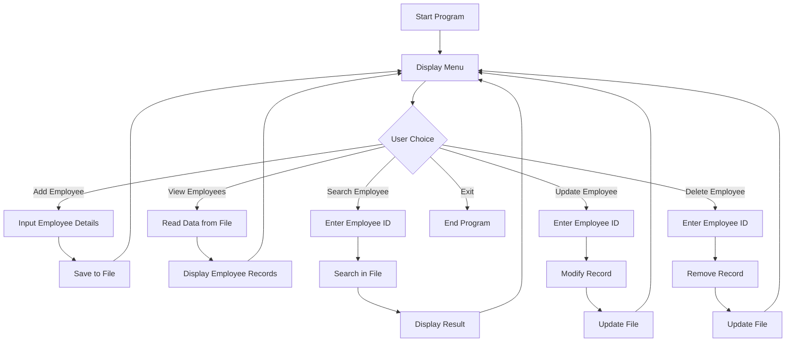

# Advanced Employee Management System (C++)

The **Advanced Employee Management System** is a console-based C++ application designed to manage employee records efficiently. It provides essential features such as adding, viewing, updating, searching, and deleting employee data while ensuring persistent storage using file handling.

This project demonstrates the practical use of structured programming concepts in C++.

---

## ✨ Features

- Add new employee records  
- View all employees  
- Search employees by ID  
- Update employee information  
- Delete employee records  
- Store data permanently using files  
- Menu-driven and user-friendly interface  

---
## 📊 System Diagram



---

## 🛠 Technologies Used

**Programming Language**
- C++

**Core Concepts**
- Structures  
- File Handling  
- Functions  
- Loops and Conditional Statements  

---

## 📁 Project Structure
```
Advanced-Employee-Management-System-2/
│
├── Employee_magagement_systme.cpp
└── README.md
```


---

## ▶️ How to Run

### Compile the program
```bash
g++ Employee_magagement_systme.cpp -o employee
```
## Run the program
Linux / macOS
```
./employee
```
Windows
```
employee.exe
```
## 🎯 Purpose of the Project

This project was created to understand how employee information can be stored, managed, and retrieved in a real-world scenario using C++. It helps strengthen concepts of data handling, file operations, and program organization.

## 🚀 Future Enhancements
- Add login authentication (Admin/User)
- Implement salary and department modules
- Add sorting and filtering of records
- Integrate with a database system
- Build a graphical user interface (GUI)

## Author
Roshan Kumar Ram

GitHub: https://github.com/okroshan4u
